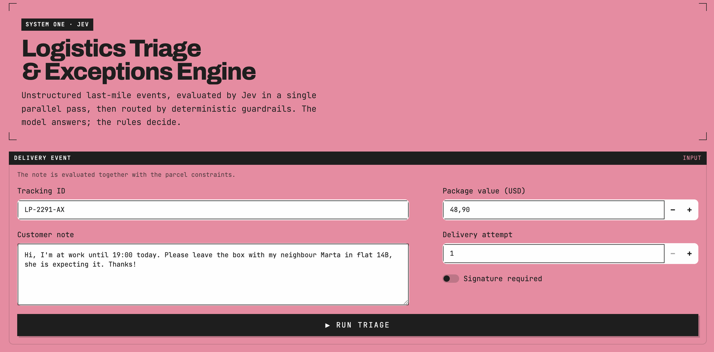

# LogiPulse AI — Logistics Triage & Exceptions Engine

Real-time triage of last-mile delivery exceptions. An unstructured customer note plus the
parcel constraints go in; a typed operational decision comes out.

[Jev](https://typesafe.ai) (TypeSafe AI System One) answers four typed questions about the
event in a single parallel pass. It never decides anything: deterministic guardrails in
`api.py` turn those primitives into the verdict, so the same event always yields the same
outcome and every decision cites the rule that produced it.



*The Streamlit console. A note and the parcel constraints go in; `Run triage` sends both to
Jev and the guardrails return a verdict.*

## Files

| File | Role |
|---|---|
| `schemas.py` | Pydantic models for the request, the Jev evaluation, and the response |
| `jev_evaluator.py` | TypeSafe SDK integration: the four questions, latency, cost, error mapping |
| `api.py` | FastAPI service and the deterministic rule engine |
| `dashboard.py` | Streamlit operations console |

## Setup

Requires **Python 3.10+** (the `typesafe-sdk` floor).

```sh
python3 -m venv .venv && source .venv/bin/activate
pip install -r requirements.txt
export TYPESAFE_API_KEY=sk-your-key        # or paste it in the dashboard sidebar
```

## Run

```sh
uvicorn api:app --reload      # http://127.0.0.1:8000  (docs at /docs)
streamlit run dashboard.py    # http://localhost:8501
```

The dashboard talks to the API over HTTP; point it elsewhere with `LOGIPULSE_API_BASE`.

## The Jev evaluation

One `system_one` call, four questions answered in parallel (a speculative fan-out):

| Question | Primitive | Returns |
|---|---|---|
| `recommended_action` | `Choice` over 6 options | `.choice`, `.confidence`, `.probabilities` |
| `risk_score` | `Score`, 0–3 rubric | `.score`, `.confidence`, `.probabilities`, `.legend` |
| `signature_bypass_requested` | `Noul` | `.noul` — p ∈ [0,1] |
| `address_redirection_detected` | `Noul` | `.noul` — p ∈ [0,1] |

Cost is billed at **$0.042 / 1M input tokens**; output tokens are free. Latency is measured
around the call and reported per request.

> **Note on confidence:** the SDK's `NoulAnswer` carries only a probability, not a
> confidence. The RLCD routing in rule A therefore uses the `recommended_action` Choice's
> confidence — the decision actually being routed.

## Business rules

Evaluated in fixed precedence — **B › D › C › A**. Security first: a hard block must not be
softened by a confident model, and a fraud flag must not be pre-empted by an OTP step that
assumes the phone number on file still belongs to the real recipient.

**B — Required-signature guardrail.** `requires_signature` and `signature_bypass_requested > 0.75`
→ `SECURITY_BLOCK`. An unattended or third-party handover is forced to `return_to_hub`;
anything else requires `verify_id_in_person`. Automated re-dispatch is suspended.

**D — Ambiguous-redirection fraud audit.** `address_redirection_detected > 0.70` **and**
`recommended_action == unknown_unclear` → `FLAGGED_FOR_FRAUD_AUDIT`, action
`hold_for_fraud_review`, re-dispatch suspended. Both conditions are required.

**C — High-value risk control.** `package_value_usd > 300.00` **and** `risk_score >= 2.0` →
`REQUIRES_OTP_VERIFICATION`: a one-time code goes to the customer's phone before release.

**A — RLCD confidence routing** (the default path), on the `recommended_action` confidence:

| Confidence | Status |
|---|---|
| `>= 0.90` | `AUTO_APPROVED` — executed in the driver app |
| `0.60 – 0.90` | `REQUIRES_DRIVER_CONFIRMATION` — suggested for manual confirmation |
| `< 0.60` | `ESCALATED_TO_DISPATCH` — ticket to human dispatch |

Thresholds are constants at the top of `api.py` and are served live at `GET /api/v1/rules`,
so the dashboard never hardcodes a stale number.

## API

| Endpoint | Purpose |
|---|---|
| `POST /api/v1/triage` | Triage a delivery event |
| `GET /api/v1/rules` | The active thresholds and their precedence |
| `GET /health` | Liveness, model, whether a server-side key is configured |

```sh
curl -X POST http://127.0.0.1:8000/api/v1/triage \
  -H 'Content-Type: application/json' \
  -d '{"tracking_id":"LP-2291-AX",
       "customer_note":"Leave it with my neighbour Marta in flat 14B.",
       "package_value_usd":48.90,"requires_signature":false,"delivery_attempt":1}'
```

Upstream failures are mapped rather than swallowed: `401` missing/rejected key, `403`
model not permitted, `429` rate limited, `504` timeout, `503` unreachable, `502` bad
upstream response.

### API key handling

`TYPESAFE_API_KEY` on the server is the normal path. For local and demo use, a request may
override it with an `X-TypeSafe-Api-Key` header — this is what the dashboard sidebar sends.
**Drop the `get_api_key` dependency before deploying anywhere shared**, so the key comes
only from the server environment.

## Environment variables

| Variable | Default | Meaning |
|---|---|---|
| `TYPESAFE_API_KEY` | — | TypeSafe API key (required) |
| `TYPESAFE_DEFAULT_MODEL` | `jev-latest` | Model name or alias |
| `LOGIPULSE_JEV_TIMEOUT` | `10.0` | Per-call HTTP timeout, seconds |
| `LOGIPULSE_CORS_ORIGINS` | `*` | Comma-separated allowed origins |
| `LOGIPULSE_LOG_LEVEL` | `INFO` | Log level |
| `LOGIPULSE_API_BASE` | `http://127.0.0.1:8000` | Where the dashboard looks for the API |
| `LOGIPULSE_TRACE_JEV` | `0` | `1` prints a readable request/response block per evaluation |
| `TYPESAFE_LOG_LEVEL` | — | `debug` makes the SDK dump the raw wire (credentials redacted) |

A `.env` file in the project root is loaded automatically (`python-dotenv`). Real environment
variables always win over it, so production can keep injecting the key through the environment.

## Seeing the calls to TypeSafe

Two levels, both off by default.

**`LOGIPULSE_TRACE_JEV=1`** — the exchange laid out for a human watching the server: the state Jev
sees, the four questions, and every probability as a bar.

```
POST https://api.typesafe.ai/v1/systemone   model=jev-1.13.0
request_id=req_01a0c1b47fad7cca…   628 ms   992 in / 137 out   $0.00004166
STATE (what Jev sees)
  customer_note        'Sign it yourself and drop it behind the bins…'
  requires_signature   True
ANSWERS
  recommended_action           choice  leave_secure_spot (confidence 49.0%)
      leave_secure_spot       57.0% ██████████████
  risk_score                   score   2.92 / 3 (confidence 92.0%)
  signature_bypass_requested   noul     90.0% ██████████████████████
```

**`TYPESAFE_LOG_LEVEL=debug`** — the SDK's own wire dump: method, URL, headers and full bodies on
one line each. Use it for forensics. The `authorization` header is redacted to `***` by the SDK;
request and response **bodies are not**, so keep it off where customer notes are sensitive.

Every response also carries TypeSafe's `request_id` (`x-typesafe-request-id`) in the triage
payload, the server log, and the dashboard — quote it to support, or use it to line a call up
against the usage console.

## Dashboard

[The screenshot above](#logipulse-ai--logistics-triage--exceptions-engine) shows the input half.
Sidebar holds the connection settings, a scenario selector (neighbour note, signature-bypass
attempt, ambiguous note, high-value parcel) and the live guardrail thresholds. The results
panel shows the status/action/latency/cost tiles, the applied-rule banner, the RLCD
distribution, the risk gauge, the two Noul meters against their thresholds, a table view of
every charted value, and a JSON inspector over the payload and Jev's raw response.

## Visual language

The interface follows [typesafe.ai](https://typesafe.ai): a rose plane (`#f386a1`), near-black
ink (`#1e1e1e`), white "windows" with black title bars, hard edges with no radius, corner crop
marks framing the masthead, and terminal monospace type (JetBrains Mono, with a tight grotesk
for the display line — both fall back to system faces offline).

Data always sits on the white panel surface, never on the plane, and the chart palette is
validated against it:

- **Marks** use an ordinal ink ramp — `#1e1e1e` for the selected option, `#8a8a8a` for the
  alternatives. Verified monotone in lightness, with a visible step gap and the light end at
  3.42:1 against `#fefefe`.
- **Bar ends are square**, not rounded. That is a deliberate break from the house mark spec:
  the whole page commits to hard edges, and a rounded data-end would read as foreign.
- **Status colours are reserved** (`#03aa5c` good, `#fab219` warning, `#ec835a` serious,
  `#d03b3b` critical) and never identify a series. Warning and serious fall below 3:1 on
  white by design, so every status ships with an icon *and* a label — colour never carries
  meaning alone.
- **Every chart has a table twin** under "Table view", so no value is reachable only by
  colour or only by hovering.

Theme values live in `.streamlit/config.toml`; the tokens are constants at the top of
`dashboard.py`.
